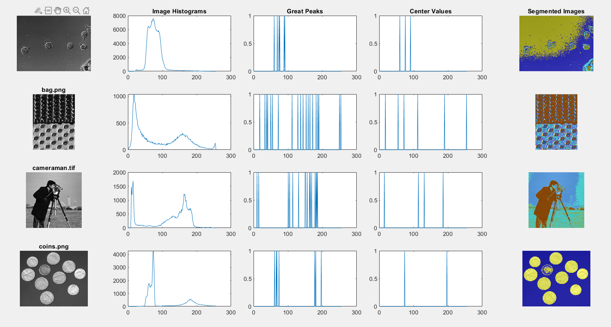
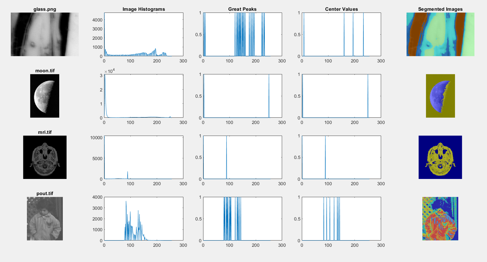
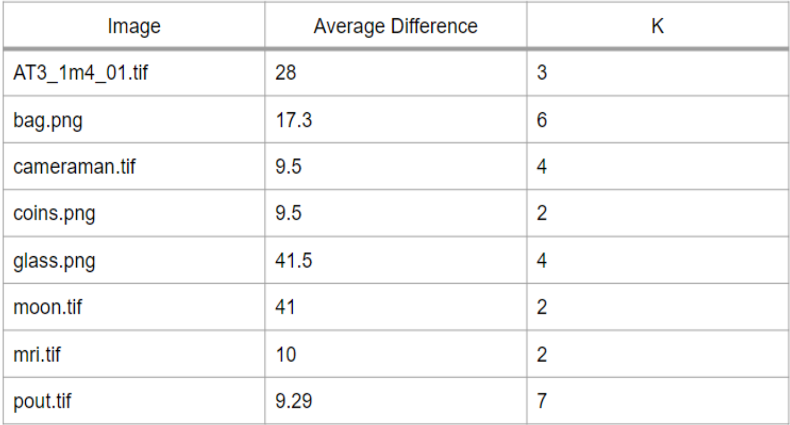

### Histogram Based Segmentation

This project was done for USU's CS 5680 class, Computer Vision. The goal of the project is to implement a histogram based segmentation algorithm to find *k* and starting centers for the k-means algorithm. The segmentation algorithm is from the paper 'Histogram-based Automatic segmentation of images' by K&#252;&#231;&#252;kk&#252;lahh, Pakize Erdo&#287;mu&#351;. The paper can be found [here](https://link.springer.com/content/pdf/10.1007/s00521-016-2287-7.pdf). The authors of the paper pose the problem that in order for k-means segmentation to work, *k* needs to be known before hand. But that is not always easy to do or optimal when handling many images. They suggest a histogram-based algorithm that automatically finds *k* and the centers and can then be applied to the k-means algorithm. 

#### Algorithm

The algorithm is as follows:

- Create a histogram of the image
- Find the peaks and pits of the histogram and mark them
- Vertically scan the histogram of peaks and pits and keep only the peaks larger than the average difference between each peak and the following pit. These are the great peaks
- Horizontally scan the great peaks and keep only the peaks that are larger than the average difference between each peak and the following peak. These are the centers for k-means
- The number of centers found after the horizontal scan is the number of clusters *k*

#### My implementation

I implemented their method using MATLAB. The following describes what is needed to run the code and the results.

##### Requirements

I used MATLAB R2022a, Academic version, to develop and run the code. 

In order to run **main.m**, you will need images to test on. I used a set of images found within MATLAB and saved them in a folder labeled *Images/BW*. The images are all grayscale images. 

I also used Berkeley Dataset to test on as well, the images can be found [here](https://www2.eecs.berkeley.edu/Research/Projects/CS/vision/bsds/). The link to download them is in the section marked 'Downloads' and you can get them seperate from the ground truth segmentations. They are in a .tgz file, so you will need to extract them and save them into a file labeled *Images/BerkeleySet* to run tests on these images. 

##### Functions

The algorithm is broken into 4 functions:

- GetPeaksAndPits.m
    - this function takes the histogram and returns a histogram that marks the peaks and pits as '1'.
- GetGreatPeaks.m
    - this function takes the peaks and pits histogram and the image histogram and returns a histogram that marks the great peaks as '1'. This is the vertical scanning step.
- GetPeakPlaces.m
    - this function takes the great peaks histogram and returns the locations of the great peaks and the total distance between each peak. This is the first part of the horizontal scanning step.
- GetCenters.m
    - this function takes the places of the great peaks and returns a list of the centers and a histogram version of the centers. This is the second part of the horizontal scanning step.

All of these functions are used in the **KPredict.m** function. This function takes the original image and returns the number of clusters *k* and the centers for k-means. The **KPredict.m** function is the only function that needs to be called to run the algorithm.

Here are some helper functions that were used in development of the algorithm:

- MeanDiffScore.m
    - this function took a list of centers found from the KPredict function and a set of ground truth centers for the same image and found the average difference between each center and the closest ground truth center.

- displayResults.m
    - This function used the KPredict funtion on a set of images and displayed the results found for the image.

##### Results

The results of my implementation did not directly match what the original authors had. I usually found a higher *k* than the results from the authors. Below are some of the segmentation results that I found:

As can be seen in the 'Segmented Image' column, some of the images were poorly segmented, such as the 'cameraman.tif'. The backgrond sky portion is segmented into two when it should be one segment. Further tests on images from the Berkeley set shows that images with a lot of small details have very messy segments. The poor segmentation is due to the higher number of *k* found. I believe this was caused by differences in the definition of a peak or a pit, and results in a different averaged distances than would be desired. 

Below in the difference in centers found with the algorithm and the ones found using the matlab built-in function *imsegkmeans*:

As can be seen, the variance between the two found centers list was high. Some of the differences were small and others were high. 

##### Conclusion

Histogram-based segmenation is a powerful tool to use to automate the k-means algorithm. Even in images with small variances in intensities. 
